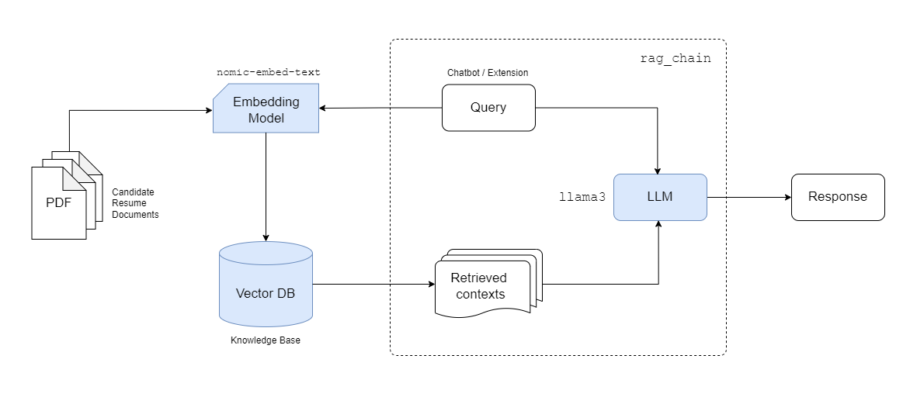

<h1 align="center">
  <br>
  <!-- <a href="http://www.amitmerchant.com/electron-markdownify"></a>
  <br> -->
  ResumeChat AI
  <br>
</h1>

<h4 align="center">A RAG app to chat with Applicants' Resume and Chrome extension to connect on LinkedIn.</h4>

<p align="center">
  <!-- <a href="https://badge.fury.io/js/electron-markdownify">
    
  </a>
  <a href="https://gitter.im/amitmerchant1990/electron-markdownify"></a> -->
  <!-- <a href="">
      
  </a> -->
  <a href="https://github.com/zzarif/ResumeChat-AI">
    
  </a>

  <!-- <a href="https://fastapi.tiangolo.com/">
    
  </a> -->
  <a href="https://www.langchain.com/">
    
  </a>
  <!-- <a href="">
    
  </a>  -->
    <a href="https://ollama.com/download">
  </a>
  <a href="https://streamlit.io/">
    
  </a>
  <a href="https://opensource.org/licenses/MIT">
    
  </a>

</p>

<p align="center">
  <a href="#-overview">Overview</a> •
  <a href="#-architecture">Architecture</a> •
  <a href="#-chatbot">Chatbot</a> •
  <a href="#-chrome-extension">Chrome Extension</a> •
  <a href="#%EF%B8%8F-build-from-source">Build from Source</a> •
  <a href="#-contact">Contact</a>
</p>

## 📋 Overview

A Retrieval-Augmented Generation (RAG) app for HRs to chat with Applicants' Resume and Chrome extension to connect on LinkedIn. Key features:

1. [**Chatbot**](#-chatbot):
  - Upload applicants' Resumes as PDF files via File Uploader (accepts multiple files).
  - Chat and ask questions about the Resumes to gain valuable insights about the candidates.
  - It is developed with `streamlit` and uses `sseclient` to generate streamed response.

2. [**Chrome Extension**](#-chrome-extension):
  - Load the chrome extension and let AI reply to LinkedIn posts with just a click!
  - It is developed with pure `javascript` and uses the same API as chatbot to complete response.

3. [**Backend**](#%EF%B8%8F-build-from-source):
  - Utilizes `nomic-embed-text` embedding model to split and convert the PDF docs to `chromadb` vector database.
  - Retrieves contexts from chat queries and invokes local `llama3` LLM to generate contextually accurate response.
  - The backend was developed with `fastapi` and `langchain` to produce streamed output.

## 💡 Architecture



## 💬 Chatbot
(Demo coming soon)

## 🌐 Chrome Extension
(Demo coming soon)

## ⚙️ Build from Source

### Serve Ollama

1. Download and install **Ollama** from https://ollama.com/download

2. Pull required open-source LLMs (here we use [`llama3`](https://ollama.com/library/llama3), you can use other models like [`mistral`](https://ollama.com/library/mistral), [`llama2-uncensored`](https://ollama.com/library/llama2-uncensored), etc.)

```bash
ollama pull llama3
```

3. Pull required embedding models (here we use [`nomic-embed-text`](https://ollama.com/library/nomic-embed-text))

```bash
ollama pull nomic-embed-text
```

4. Serve Ollama locally (by default Ollama is served from `http://localhost:11434`)

```bash
ollama serve
```

Note: If this command results in an error, make sure to quit any running Ollama background processes.

### Setup Server and Chatbot

1. Clone the repository

```bash
git clone https://github.com/zzarif/ResumeChat-AI.git
cd ResumeChat-AI/
```

2. Install necessary dependencies

```bash
poetry install
```

3. Activate virtual environment

```bash
poetry shell
```

4. Start chatbot backend server (served from `http://localhost:8000`)

```bash
python chatbot/backend/api.py
```

5. Launch the chatbot (served from `http://localhost:8501`)

```bash
streamlit run chatbot/main.py
```

### Load Chrome Extension

1. Go to `chrome://extensions/`, or, *Chrome ▶ Manage Extensions*
2. Turn on the Developer mode
3. Click *Load Unpacked*
4. Select the [extension](extension) directory
5. Go to `https://www.linkedin.com/feed/` and start commenting!

Note: Everytime you make changes to the extension code you must first `⟳` **reload** it from *Manage Extensions* and then `⟳` **reload** `https://www.linkedin.com/feed/`

## ✉️ Contact:

[](https://www.linkedin.com/in/zibran-zarif-amio-b82717263/) [](mailto:zibran.zarif.amio@gmail.com)
